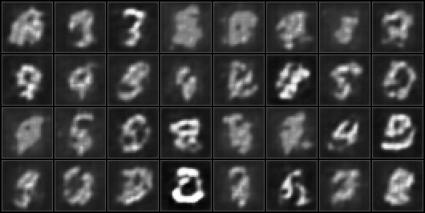
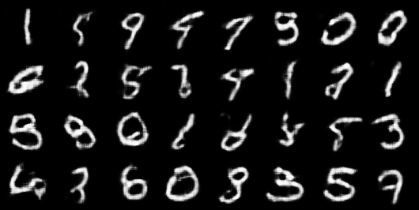
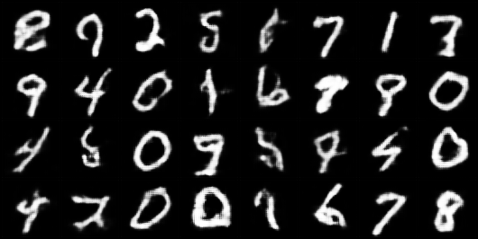
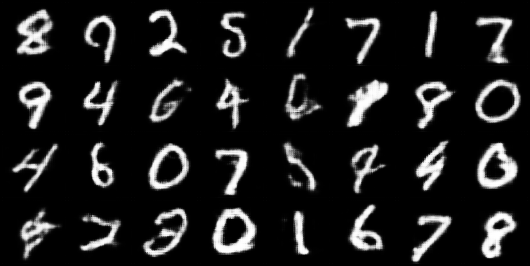
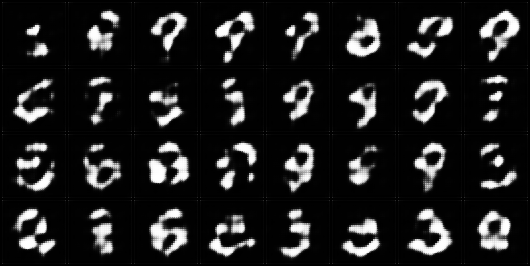
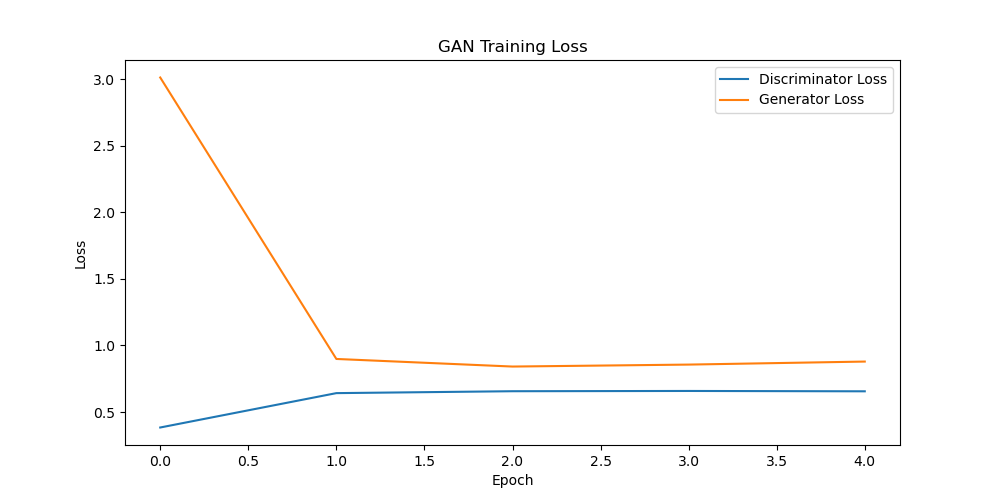
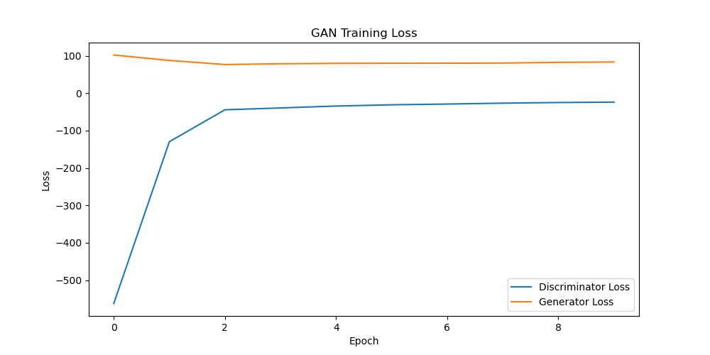

# Let's Play with GANs!

This repository is dedicated to experimenting with and implementing different types of GANs. I created this repo as part of my learning process. If you're still learning like me, hope this repo helps~


## Overview

The GAN consists of two models: a Generator and a Discriminator (a Critic in WGAN case). The Generator generates fake images, while the Discriminator classifies images as real or fake. The models are trained adversarially to improve each other over time.

- **Generator:** Takes random noise as input and generates fake images intended to resemble real images.
- **Discriminator:** Attempts to distinguish between real and fake images produced by the Generator.
- **Training Process:** The Discriminator and Generator are trained simultaneously. The Generator learns to produce more convincing fake images, while the Discriminator learns to be better at distinguishing between real and fake.


## Installation

Clone this repository to your local machine:
```bash
git clone https://github.com/cxycode32/Lets-Play-With-GANs.git
cd Lets-Play-With-GANs
```

Install the required dependencies:
```bash
pip install -r requirements.txt
```


### How to Run?
```bash
python gan.py
```

### Visualization:

#### Fake Images
Helper function to save fake images generated by the generator.
```
def save_fake_images(generator, fixed_noise, epoch, dir=IMAGE_DIR):
```

#### Fake Images GIF
Helper function to create a GIF from fake images.
```
def create_gif(assets_dir=ASSETS_DIR, image_dir=IMAGE_DIR, filename="gan_training.gif"):
```

#### Discriminator and Generator Loss Visualization
Helper function to visualize discriminator losses and generator losses.
```
def plot_losses(disc_losses, gen_losses, dir=ASSETS_DIR, filename="gan_loss.png"):
```

#### Tensorboard
Run the following command:
```
tensorboard --logdir logs
```
After you've finished running the script. Remember to `cd` to the directory where your `logs` folder is.


## DCGAN vs. WGAN

### DCGAN (Deep Convolutional Generative Adversarial Network)

DCGAN is a type of GAN that uses deep convolutional layers to improve the stability and quality of generated images.It consists of two main components: the generator and the discriminator.
The generator creates fake images from random noise, while the discriminator distinguishes between real and fake images.
Both networks are trained adversarially, meaning the generator gets better at creating realistic images as the discriminator gets better at detecting fake ones.

### WGAN (Wasserstein GAN)

WGAN is an improvement over traditional GANs that addresses issues like mode collapse and training instability by using the Wasserstein distance (Earth Mover’s Distance) as a measure of distribution similarity instead of the Jensen-Shannon (JS) divergence used in standard GANs.

### Comparison

#### Fake Images
DCGAN fake image at epoch 1:

WGAN fake image at epoch 1:


DCGAN fake image at epoch 5:

WGAN fake image at epoch 5:


WGAN fake image at epoch 10:


#### Fake Images GIF

DCGAN fake images GIF:

WGAN fake images GIF:


#### Discriminator and Generator Loss Visualization

DCGAN Loss Plot:

WGAN Loss Plot:



## Acknowledgments

This implementation is inspired by the [Machine-Learning-Collection](https://github.com/aladdinpersson/Machine-Learning-Collection) repository by [aladdinpersson](https://github.com/aladdinpersson). The code structure and visualization techniques are adapted and extended from this collection.