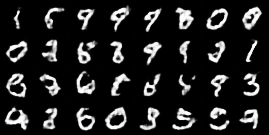
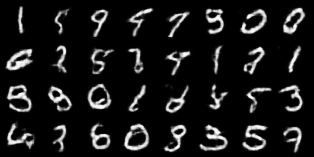
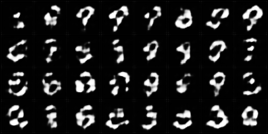

# Let's Play wit GANs!

This repository is dedicated to experimenting with and implementing different types of GANs. I created this repo as part of my learning process. If you're still learning like me, hope this repo helps~

The repository will include the following GAN types:

- **DCGAN** ✅ (Completed)
- **WGAN** 🚧 (Work in Progress)


## Overview

The GAN consists of two models: a Generator and a Discriminator. The Generator generates fake images, while the Discriminator classifies images as real or fake. The models are trained adversarially to improve each other over time.

- **Generator:** Takes random noise as input and generates fake images intended to resemble real images.
- **Discriminator:** Attempts to distinguish between real and fake images produced by the Generator.
- **Training Process:** The Discriminator and Generator are trained simultaneously. The Generator learns to produce more convincing fake images, while the Discriminator learns to be better at distinguishing between real and fake.


## Installation

Clone this repository to your local machine:
```bash
git clone https://github.com/cxycode32/Lets-Play-With-GANs.git
cd Lets-Play-With-GANs
```

Install the required dependencies:
```bash
pip install -r requirements.txt
```

## DCGAN (Deep Convolutional Generative Adversarial Network)

DCGAN is a type of GAN that uses deep convolutional layers to improve the stability and quality of generated images. It consists of two main components: the generator and the discriminator.
The generator creates fake images from random noise, while the discriminator distinguishes between real and fake images.
Both networks are trained adversarially, meaning the generator gets better at creating realistic images as the discriminator gets better at detecting fake ones.

### Features:

- **Convolutional Layers:** Utilizes deep convolutional layers instead of fully connected layers to improve image generation quality.
- **Generator:** The generator transforms random noise into images that resemble the real data distribution.
- **Discriminator:** The discriminator tries to differentiate between real and fake images by assigning a probability score.
- **Adversarial Training:** Both networks are trained simultaneously, with the generator trying to "fool" the discriminator, and the discriminator trying to correctly classify real and fake images.
- **Leaky ReLU Activations:** Leaky ReLU is used in the discriminator to allow some gradient flow even when the input is negative, helping to mitigate the vanishing gradient problem.

### How to Run?
```
cd DCGAN
python gan.py
```

### Visualization:

#### Fake Images
Helper function to save fake images generated by the generator.
```
def save_fake_images(generator, fixed_noise, epoch, dir=IMAGE_DIR):
```
Fake image created at epoch 1:


Fake image created at epoch 3:


Fake image created at epoch 5:


#### Fake Images GIF
Helper function to create a GIF from fake images.
```
def create_gif(assets_dir=ASSETS_DIR, image_dir=IMAGE_DIR, filename="gan_training.gif"):
```


#### Discriminator and Generator Loss Visualization
Helper function to visualize discriminator losses and generator losses.
```
def plot_losses(disc_losses, gen_losses, dir=ASSETS_DIR, filename="gan_loss.png"):
```


#### Tensorboard
Run the following command:
```
tensorboard --logdir logs
```
After you've finished running the script. Remember to `cd` to the directory where your `logs` folder is.


## Acknowledgments

This implementation is inspired by the [Machine-Learning-Collection](https://github.com/aladdinpersson/Machine-Learning-Collection) repository by [aladdinpersson](https://github.com/aladdinpersson). The code structure and visualization techniques are adapted and extended from this collection.